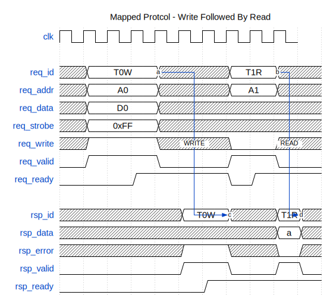

# Mapped Interface

## Timing Diagram

{ width=100% }

## Summary

The mapped interface allows an initiator to request access to a specific address
in a memory pool, either reading or writing the contents of the addressed element.
The interface is separated into request and response channels, with each channel
acting similarly to a [stream interface](stream.md) (`VALID`/`READY` signalling
acts in the same way but the interface carries extra components).

## Components

The request (i.e. `REQ_...`) portion of the interface is primarily driven by the
initiator, while the response (i.e. `RSP_...`) portion of the interface is
primarily driven by the responder.

### Requests

The initiator drives up to six components of the request interface:

 * `REQ_ID` - links a response to a request matched on the provided ID;
 * `REQ_ADDR` - carries the address to be accessed;
 * `REQ_DATA` - carries write data;
 * `REQ_STROBE` - carries byte-strobes for the write data;
 * `REQ_WRITE` - distinguishes between write (`1`) or read (`0`) requests;
 * `REQ_VALID` - qualifies the request;

The responder drives one component of the request interface:

 * `REQ_READY` - indicates to the initiator that the request has been accepted;

A request is made from the initiator to the responder on the rising clock edge
following both `REQ_VALID` and `REQ_READY` being asserted.

The only compulsory components of the interface are `REQ_ADDR`, `REQ_VALID`, and
`REQ_READY` - other components may be included as required. For example a
read-only interface can omit `REQ_DATA`, `REQ_STROBE`, and `REQ_WRITE`.

### Responses

The initiator drives one component of the response interface:

 * `RSP_READY` - indicators to the responder that the response has been accepted;

The responder drives up to four components of the response interface:

 * `RSP_ID` - copies the ID provided in the request to link the transaction;
 * `RSP_DATA` - carries read data;
 * `RSP_ERROR` - indicates whether an error occurred;
 * `RSP_VALID` - qualifies the response;

A response is made from the responder to the initiator on the rising clock edge
following both `RSP_VALID` and `RSP_READY` being asserted.

The only compulsory components of the interface are `RSP_VALID` and `RSP_READY`
- other components may be included as required. For example a simple read
interface can omit `RSP_ID` and `RSP_ERROR`.

## Signalling Rules

These rules apply to both `REQ_...` and `RSP_...` interfaces:

 * Once `VALID` has been asserted it may not be de-asserted until `READY` is
   observed high at the subsequent rising clock edge;
 * Once `VALID` has been asserted `ADDR`, `DATA`, and other request and response
   components must be stable until `READY` is observed high at the subsequent
   rising clock edge;
 * `READY` must not be driven by combinational logic that involves any of the
   interface signals (including `VALID`) to avoid creating problematic timing
   paths;
 * This interface is NOT inherently safe for clock domain crossings and therefore
   it must be correctly synchronised.

## Transaction Ordering Rules

These rules apply between paired requests and responses:

 * If the interface carries `REQ_ID` and `RSP_ID` then for any specific ID value
   responses must be presented onto the bus in the **SAME** order that the
   requests were presented, but responses from different IDs may be interleaved
   in **ANY** order;

 * If the interface does not carry `REQ_ID` or `RSP_ID` then all responses must
   be presented onto the bus in the **SAME** order that the requests were
   presented;

 * Responses must be presented on a cycle **AFTER** the request is made, never
   in the same cycle (infers combinatorial logic) or before the request is made.

## Naming Convention

### Initiator

Request components should use the following naming convention for signals:

 * `REQ_ADDR` (and similar) should be carried by `o_<NAME>_req_addr`;
 * `REQ_VALID` should be carried by `o_<NAME>_req_valid`;
 * `REQ_READY` should be carried by `i_<NAME>_req_ready`.

Where `<NAME>` is a unique and consistent name for the interface, for example
`o_mem_req_addr`, `o_mem_req_valid`, `i_mem_req_ready`.

Response components should use the following naming convention for signals:

 * `RSP_DATA` (and similar) should be carried by `i_<NAME>_rsp_data`;
 * `RSP_VALID` should be carried by `i_<NAME>_rsp_valid`;
 * `RSP_READY` should be carried by `o_<NAME>_rsp_ready`.

### Responder

Request components should use the following naming convention for signals:

 * `REQ_ADDR` (and similar) should be carried by `i_<NAME>_req_addr`;
 * `REQ_VALID` should be carried by `i_<NAME>_req_valid`;
 * `REQ_READY` should be carried by `o_<NAME>_req_ready`.

Where `<NAME>` is a unique and consistent name for the interface, for example
`i_mem_req_addr`, `i_mem_req_valid`, `o_mem_req_ready`.

Response components should use the following naming convention for signals:

 * `RSP_DATA` (and similar) should be carried by `o_<NAME>_rsp_data`;
 * `RSP_VALID` should be carried by `o_<NAME>_rsp_valid`;
 * `RSP_READY` should be carried by `i_<NAME>_rsp_ready`.
