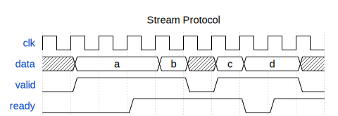

# Stream Interface

## Timing Diagram

{ width=100% }

## Summary

This interface allows a stream of data to be transferred between two components,
allowing for the upstream component to produce ticks of data at any rate it can
sustain and allowing the downstream component to consume ticks of data at any
rate it can sustain.

## Components

The upstream component drives two components of the interface:

 * `DATA` - carries the data that is being transferred between the upstream and
   downstream;
 * `VALID` - qualifies when the data being transferred is ready to be sampled by
   the downstream.

The downstream component drives one component of the interface:

 * `READY` - informs the upstream component when the downstream component is
   ready to sample the data.

Data is transferred between the upstream and downstream on the rising clock edge
following both `VALID` and `READY` being asserted, as shown in the diagram above.

## Signalling Rules

 * Once `VALID` has been asserted it may not be de-asserted until `READY` is
   observed high at the subsequent rising clock edge;
 * Once `VALID` has been asserted the `DATA` must be stable until `READY` is
   observed high at the subsequent rising clock edge;
 * `READY` must not be driven by combinational logic that involves either the
   `DATA` or `VALID` signals to avoid creating problematic timing paths;
 * This interface is NOT inherently safe for clock domain crossings and therefore
   it must be correctly synchronised.

## Naming Convention

Upstream components should use the following naming convention for signals:

 * `DATA` should be carried by `o_<NAME>_data`;
 * `VALID` should be carried by `o_<NAME>_valid`;
 * `READY` should be carried by `i_<NAME>_ready`.

Downstream components should use the following naming convention for signals:

 * `DATA` should be carried by `i_<NAME>_data`;
 * `VALID` should be carried by `i_<NAME>_valid`;
 * `READY` should be carried by `o_<NAME>_ready`.

Where `<NAME>` is a unique and consistent name for the interface, for example
`o_decode_data`, `o_decode_valid`, `i_decode_ready`.
